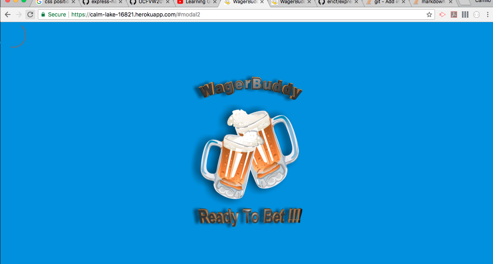

# WagerBuddy
**Version 1.0.0**

App to track all the friendly wagers you make with your friends. Wagerbuddy is an app that can be used to track those bets that we always forget about. Watching the superbowl, at a bar, tailgating, hanging out or anytime we want to bet.
---
---
## Overview

WagerBuddy initializes with a loading page. Then goes to a homepage where a modal pops up requiring the user to login inputing a nickname and email address. A button on the home screen allows the user to create a new bet. A static menu at bottom of the screen allows you to go to home screen, check current bets, check past bets and create a new bet. Several factors are considered when creating a new bet: user, stakes, time deadlines and description. We process all that info and store it into a database that is utilized dynamically to respond when the user wants to see specific info of the bets. 

---
Heroku link 
https://calm-lake-16821.herokuapp.com/#modal2
---
---
## Project tree
WAGERBUDDY
 * config
    * config.json
 * controllers
    * automation.js
    * mail.js
 * db
    * schema.sql
 * models
    * index.js
    * mail.js
    * automation.js
 * public
    * css
        * bet.css
        * main.css
        * reset.css
        * style.css
    * front
        * beer.png
        * bet.html
        * main.html
        * secondbeer.png
        * test.html
        * test.png
    * html
        * forms.html
        * newbet.html
    * images
        * favicon.ico
    * js
        * bet.js
        * lists.js
        * main.js
        * newBet.js
  * routes
    * html-routes.js
    * users-routes.js
    * wagers-routes.js
  * views
    * layouts
        * main.handlebars
    * index.handlebars
  * package-lock.json
  * package.json
  * server.js
---

## Collaborators

Travis Vadnais(Leader) 

Anthony Espinosa

Camilo Gonzalez

Jaime Salazar

Mathew Roskam

